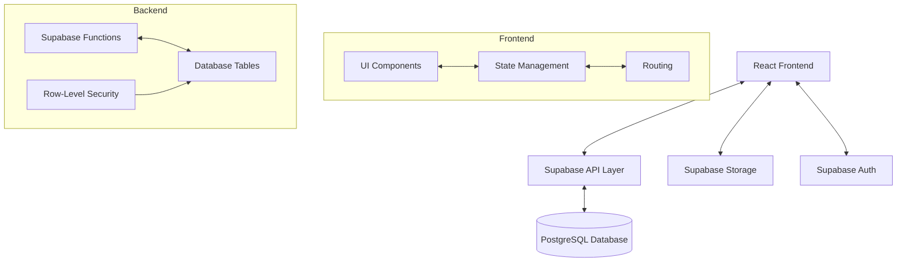
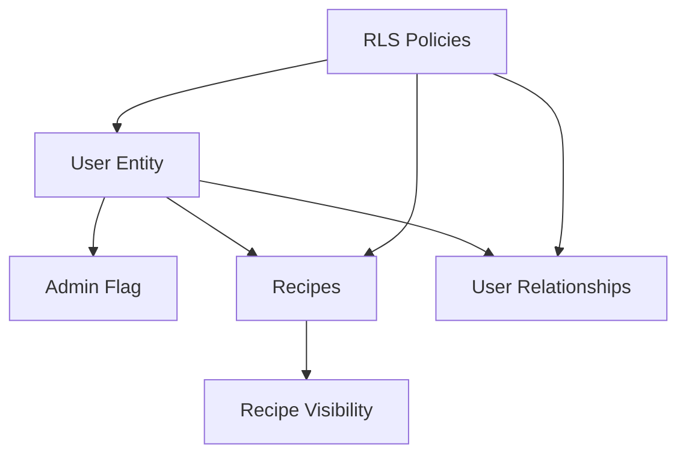
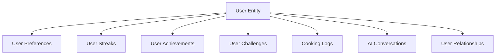
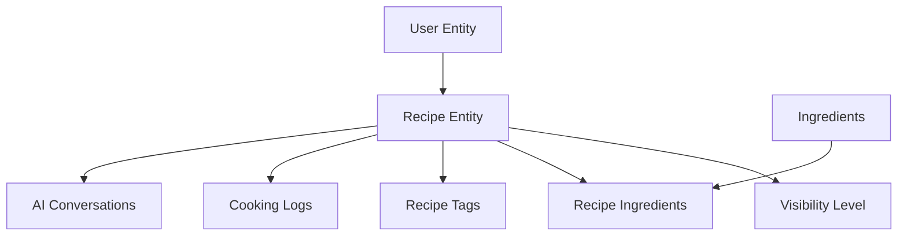
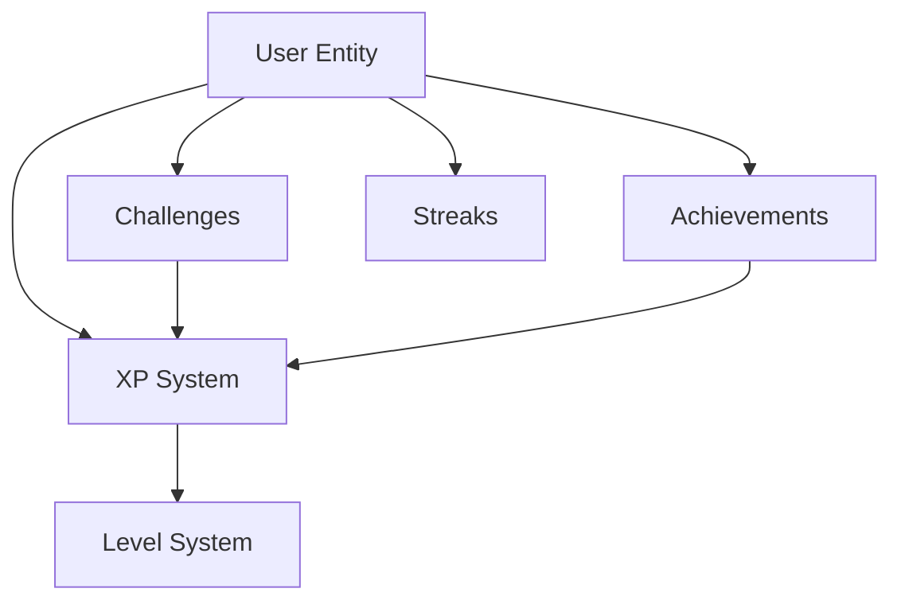

# Home Chef Hero - System Patterns

## System Architecture

Home Chef Hero follows a modern client-server architecture with a clear separation of concerns:

### Key Components

1. **Frontend Layer**
   - React application with TypeScript
   - Component-based UI architecture
   - Client-side routing
   - State management with React Context/Redux

2. **API Layer**
   - Supabase API for data access
   - RESTful endpoints for CRUD operations
   - Real-time subscriptions for live updates
   - Serverless functions for complex operations

3. **Data Layer**
   - PostgreSQL database with relational schema
   - Row-level security for data protection
   - Optimized indexes for performance
   - JSONB columns for flexible data structures

4. **Storage Layer**
   - Supabase Storage for media files
   - Secure access controls
   - Image optimization

5. **Authentication Layer**
   - Supabase Auth for user management
   - JWT-based authentication
   - Role-based permissions

## Key Technical Decisions

### Security Model

1. **Row-Level Security (RLS)**
   - All tables protected by RLS policies
   - Data access controlled at the database level
   - Policies enforce user-specific data isolation
   - Admin role with bypass capabilities for maintenance

2. **Multi-Level Visibility**
   - Recipes have public, friends-only, and private visibility options
   - Friend relationships tracked in dedicated junction table
   - Helper functions for access control logic

3. **Authentication Integration**
   - JWT tokens from Supabase Auth used for identity
   - User identity verified for all data operations
   - Security enforced consistently across all access points

### Database Design

1. **UUID Primary Keys**
   - All tables use UUID primary keys for scalability and security
   - Enables distributed ID generation without coordination

2. **Relational Structure with JSONB Flexibility**
   - Core entities use relational structure for integrity
   - JSONB columns for flexible data like preferences and instructions
   - Enables schema evolution without migrations for certain data

3. **Junction Tables for Many-to-Many**
   - Clean separation of concerns with junction tables
   - Enables additional metadata on relationships

### API Patterns

1. **RESTful API Design**
   - Standard CRUD operations follow REST principles
   - Consistent endpoint naming and response formats

2. **Real-time Subscriptions**
   - Leverages PostgreSQL's LISTEN/NOTIFY for real-time updates
   - Enables live updates for achievements, challenges, etc.

3. **Serverless Functions for Complex Logic**
   - Business logic encapsulated in serverless functions
   - Reduces client-side complexity

### Frontend Patterns

1. **Component Composition**
   - Atomic design principles for UI components
   - Reusable component library

2. **Container/Presentation Pattern**
   - Separation of data fetching and presentation
   - Enhances testability and reusability

3. **Custom Hooks for Logic Reuse**
   - Encapsulates common behaviors in custom hooks
   - Promotes code reuse across components

## Design Patterns in Use

### Repository Pattern
Used to abstract data access logic from business logic. Implemented through service classes that handle API interactions.

### Observer Pattern
Implemented via real-time subscriptions to notify components of data changes.

### Command Pattern
Used for user actions that trigger complex operations, especially in the gamification system.

### Strategy Pattern
Applied to implement different algorithms for recipe recommendations based on user preferences.

### Factory Pattern
Used to create different types of challenges and achievements.

### Decorator Pattern
Applied to enhance base components with additional functionality like authentication checks.

## Component Relationships

### Security Components

### User-Related Components

### Recipe-Related Components

### Gamification Components

## Data Flow Patterns

### Authentication Flow

1. User signs up/logs in via Supabase Auth
2. JWT token stored in local storage
3. Token included in all API requests
4. Row-level security policies enforce access control
5. User's admin status checked for privileged operations
6. Friend relationships checked for friends-only content

### Recipe Discovery Flow

1. User preferences and history analyzed
2. Recommendation algorithm suggests recipes (filtered by visibility)
3. User selects recipe
4. Access control verified via RLS policies
5. Recipe details fetched with ingredients
6. User can start cooking or save for later

### Cooking Activity Flow

1. User starts cooking a recipe
2. Step-by-step instructions presented
3. User can interact with AI assistant
4. User marks recipe as completed
5. XP awarded and achievements checked
6. Streak updated
7. Cooking log created

### Challenge Completion Flow

1. User views available challenges
2. User accepts challenge
3. Challenge requirements tracked
4. User completes required actions
5. Challenge marked as completed
6. Rewards distributed (XP, achievements)
7. New challenges unlocked based on level

### Social Interaction Flow

1. User sends friend request
2. Recipient accepts request
3. Friend relationship recorded in database
4. Friends gain access to friends-only recipes
5. Friend activity can be viewed (if enabled in preferences)
